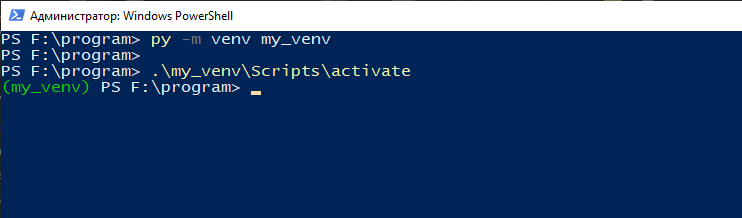

# VENV - virtual enviroment

виртуальная среда (virtual environment) в языке Python позволяет управлять проектами изолированно друг от друга, то есть
* у каждого проекта могут быть свои зависимости;
* зависимости одного проекта не влияют на зависимости другого проекта.
* каждый проект может требовать разную версию Python

Создавать виртуальное окружение в Python можно при помощи различных утилит.  

## Создание при помощи консоли:
Нужно открыть консоль ввести py -m venv "название среды" (без кавычек)  

после этого у вас появиться новая папка со средой, она появиться в папке в которой вызывалась команда в консоли  

## Активация виртуальной среды
Для активации нужно запустить файл Activate.bat из консоли  

после этого в строке ввода в консоль появиться надпись с названием среды в которой вы работаете  
## Выход из виртуальной среды

Для выхода из виртуальной среды необходимо выполнить команду: deactivate  

Python 3.3+ поставляется с модулем venv. Для более старых версий Python можно использовать сторонний инструмент virtualenv.

## Пакеты
Установите один из следующих пакетов:

* Python 3.3+: python
* Python 3: python-virtualenv

Для Pipenv:
* Python 3: python-pipenv
